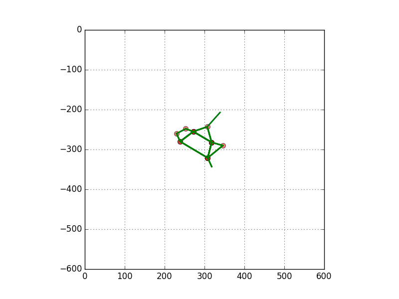

# constellations

* This is a dataset of __2D geometries__ for 86/88 [IAU endorsed constellations](https://en.wikipedia.org/wiki/88_modern_constellations#List).
* The two missing ones are __Mensa__ and __Microscopium__
    * This is because the Wikipedia image for those constellations have no lines
* To visualize any of those 86 constellations after checkout run
`./wikipedia/visualize.py --cname Orion`
* This repo also has the python code for the whole pipeline
    * The workflow starts with scraping all the Wikipedia sites for the svg link and downloading svgs to the correct places (pull_all_svgs.py)
    * batch_process_step_1.py then goes to each svg file and parses out the path objects using svgpathtools, groups them by hex color, and picks out the one that Wikipedia uses for the lines of the constellation (#addf8a)
        * It also picks out the svg transform associated with the path, applies it and does a plot for sanity checking with the index of each path in some sorting drawn next to the path in the plot.
        * It pickles everything to a step_1.p file.
    * batch_process_step_2_1.py opens up each step_1.p file and tries to find the svg path(s) closest to the center of all the paths found in that image as a starting point.
        * It writes the indicies of these pathes to a text file. step_2_1.txt
    * I manually went through all 88 and verified that the indices were correct
    * batch_process_step_2_2.py opens up each of the step_2_1.txt files, and the other pickle files, and filters out the paths by indices that correspond to that constellation.
        * It then saves info about that constellation's paths to pickles and aggregates everything into dictionary saved in ./wikipedia/data/all_segments.p pickle
    * batch_process_step_3.py goes through all constellations and looks for combinations of two connected lines, 3 points. When it finds them, it computes the line segments length ratios of the two lines, and the angle between the two lines.
    * lookup.py takes a set of 3 connected points that describe a triangle, and looks for the closest combination of 3 connected points, two line segments in all such sets in the dataset (770)
        * When it finds them, it goes to that constellation and plots a picture for sanity check.

  
  
  
  
  

